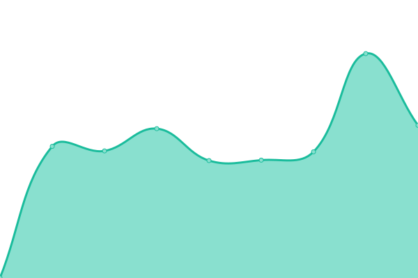

# [📈 Live Status](https://demo.upptime.js.org): <!--live status--> **🟩 All systems operational**

Visit the site [Uprise Up(time)](https://georgewelly.github.io/upriseuptime/)

This repository contains the open-source uptime monitor and status page for [George Wellington](https://www.linkedin.com/in/george-wellington-4977a3195/), powered by [Upptime](https://github.com/upptime/upptime).

With [Upptime](https://upptime.js.org), you can get your own unlimited and free uptime monitor and status page, powered entirely by a GitHub repository. We use [Issues](https://github.com/georgewelly/upriseuptime/issues) as incident reports, [Actions](https://github.com/georgewelly/upriseuptime/actions) as uptime monitors, and [Pages](https://demo.upptime.js.org) for the status page.

<!--start: status pages-->
<!-- This summary is generated by Upptime (https://github.com/upptime/upptime) -->
<!-- Do not edit this manually, your changes will be overwritten -->
<!-- prettier-ignore -->
| URL | Status | History | Response Time | Uptime |
| --- | ------ | ------- | ------------- | ------ |
|  [Uprise Up](https://www.upriseup.co.uk/) | 🟩 Up | [uprise-up.yml](https://github.com/georgewelly/upriseuptime/commits/HEAD/history/uprise-up.yml) | 

 1508ms
     
 | 

<a href="https://demo.upptime.js.org/history/uprise-up">100.00%</a>
    

|  [Charity Digital Benchmark](https://www.charitydigitalbenchmark.co.uk/) | 🟩 Up | [charity-digital-benchmark.yml](https://github.com/georgewelly/upriseuptime/commits/HEAD/history/charity-digital-benchmark.yml) | 

 1771ms
     
 | 

<a href="https://demo.upptime.js.org/history/charity-digital-benchmark">100.00%</a>
    

|  [Google](https://www.google.com) | 🟩 Up | [google.yml](https://github.com/georgewelly/upriseuptime/commits/HEAD/history/google.yml) | 

 78ms
     
 | 

<a href="https://demo.upptime.js.org/history/google">100.00%</a>
    

|  [Sue Ryder](https://www.sueryder.org/) | 🟩 Up | [sue-ryder.yml](https://github.com/georgewelly/upriseuptime/commits/HEAD/history/sue-ryder.yml) | 

 818ms
     
 | 

<a href="https://demo.upptime.js.org/history/sue-ryder">100.00%</a>
    

|  [Dementia uk](https://www.dementiauk.org/) | 🟩 Up | [dementia-uk.yml](https://github.com/georgewelly/upriseuptime/commits/HEAD/history/dementia-uk.yml) | 

 1113ms
     
 | 

<a href="https://demo.upptime.js.org/history/dementia-uk">100.00%</a>
    

|  [BW site](https://www.bwcharity.org.uk/) | 🟩 Up | [bw-site.yml](https://github.com/georgewelly/upriseuptime/commits/HEAD/history/bw-site.yml) | 

 689ms
     
 | 

<a href="https://demo.upptime.js.org/history/bw-site">100.00%</a>
    

|  [MSC site](https://www.msc.org/uk) | 🟩 Up | [msc-site.yml](https://github.com/georgewelly/upriseuptime/commits/HEAD/history/msc-site.yml) | 

 518ms
     
 | 

<a href="https://demo.upptime.js.org/history/msc-site">100.00%</a>
    

|  [MSI Choices site](https://www.msichoices.org/) | 🟩 Up | [msi-choices-site.yml](https://github.com/georgewelly/upriseuptime/commits/HEAD/history/msi-choices-site.yml) | 

 626ms
     
 | 

<a href="https://demo.upptime.js.org/history/msi-choices-site">100.00%</a>
    

|  [Royal Voluntary Services](https://www.royalvoluntaryservice.org.uk/) | 🟩 Up | [royal-voluntary-services.yml](https://github.com/georgewelly/upriseuptime/commits/HEAD/history/royal-voluntary-services.yml) | 

 796ms
     
 | 

<a href="https://demo.upptime.js.org/history/royal-voluntary-services">100.00%</a>
    

|  [Ten Health & Fitness](https://www.ten.co.uk/) | 🟩 Up | [ten-health-and-fitness.yml](https://github.com/georgewelly/upriseuptime/commits/HEAD/history/ten-health-and-fitness.yml) | 

 1403ms
     
 | 

<a href="https://demo.upptime.js.org/history/ten-health-and-fitness">99.62%</a>
    

<!--end: status pages-->

[**Visit our status website →**](https://demo.upptime.js.org)

## 📄 License

- Powered by: [Upptime](https://github.com/upptime/upptime)
- Code: [MIT](./LICENSE) © [George Wellington](https://www.linkedin.com/in/george-wellington-4977a3195/)
- Data in the `./history` directory: [Open Database License](https://opendatacommons.org/licenses/odbl/1-0/)
